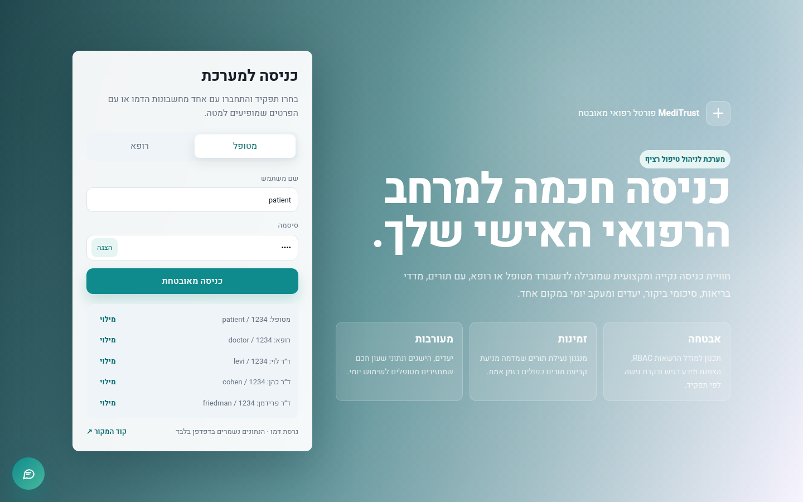
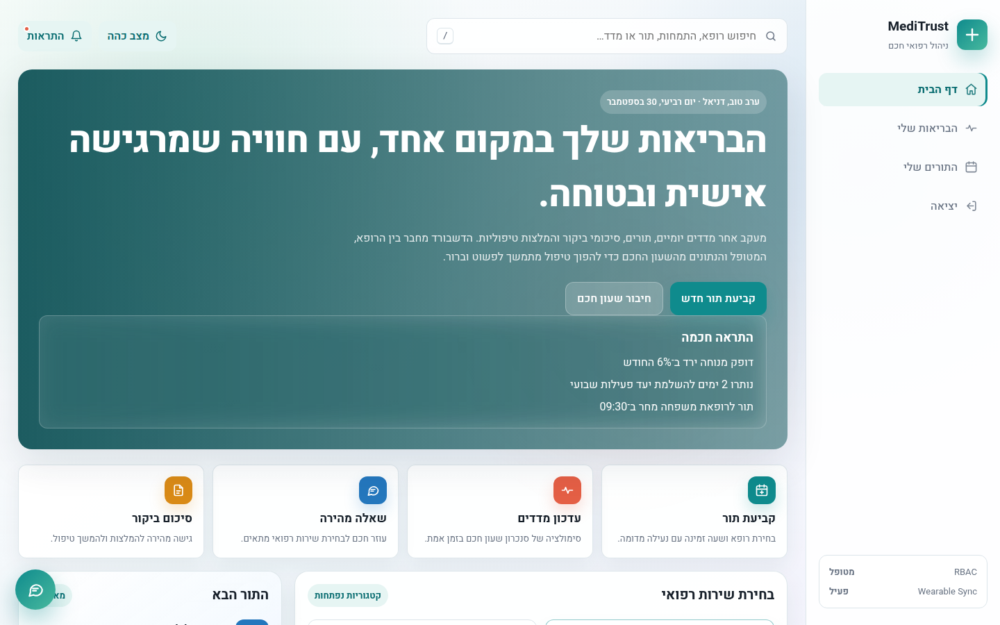
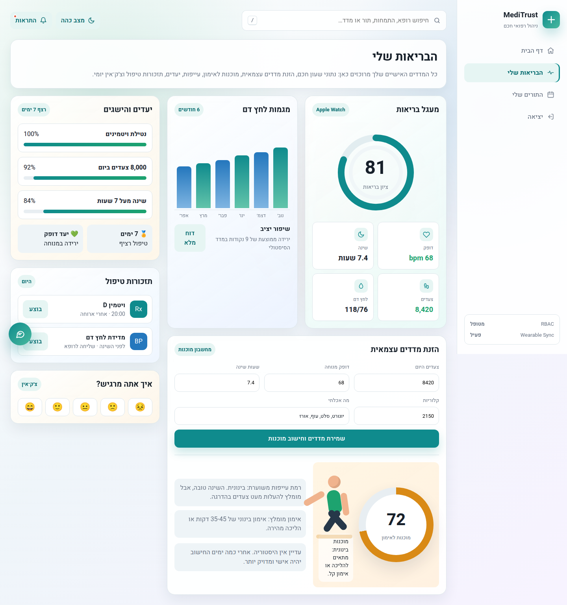
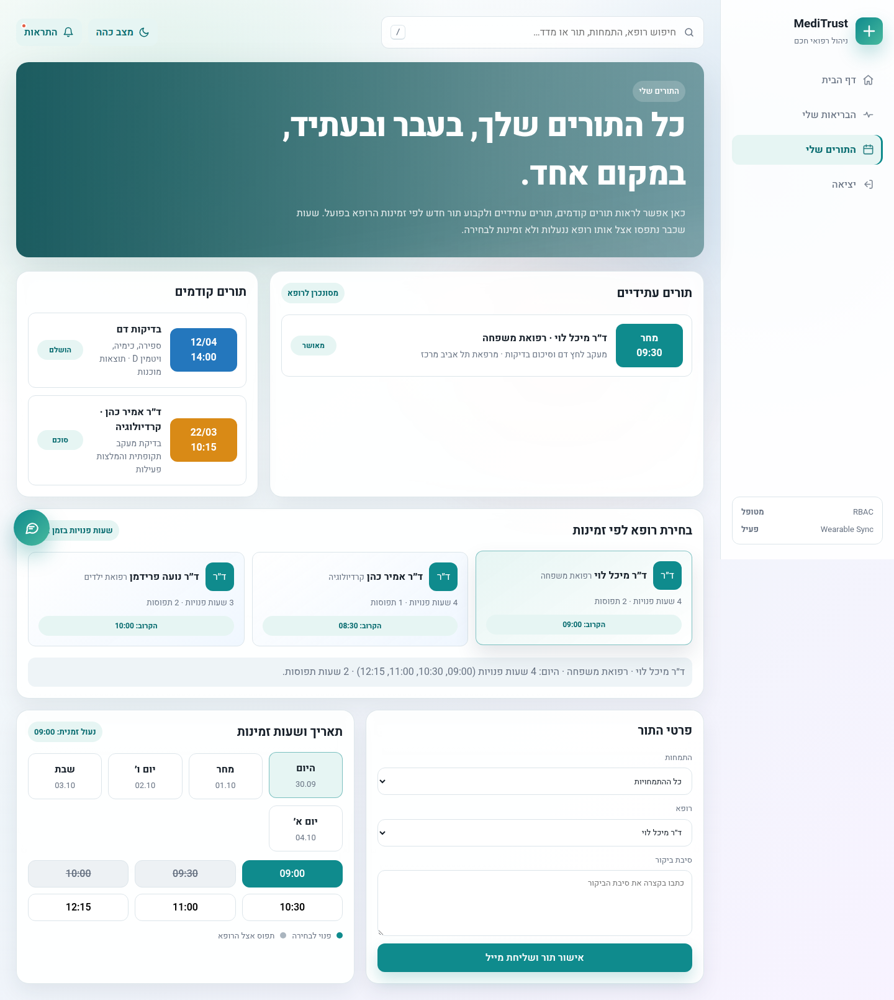
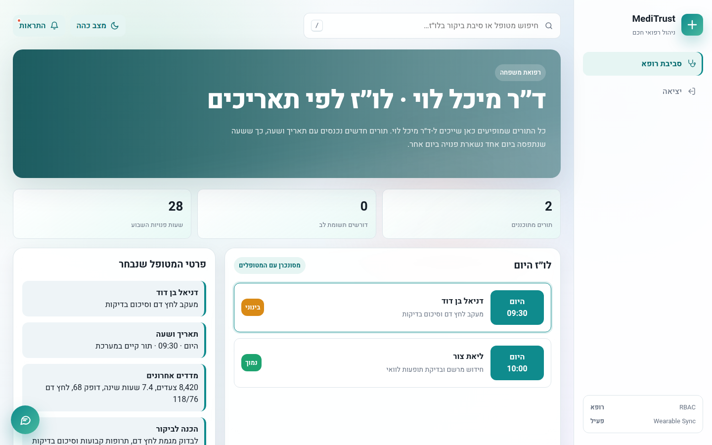
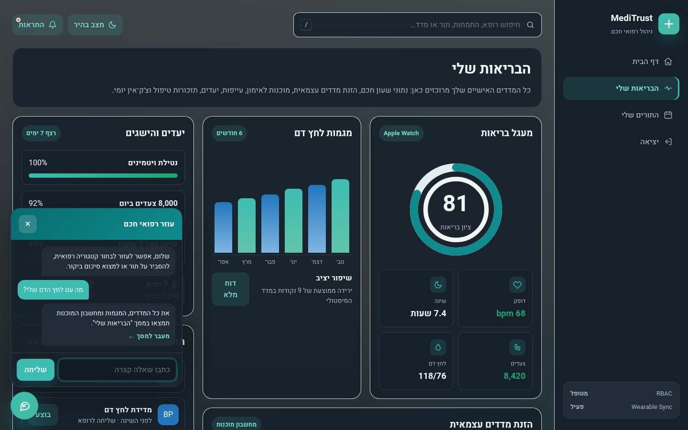
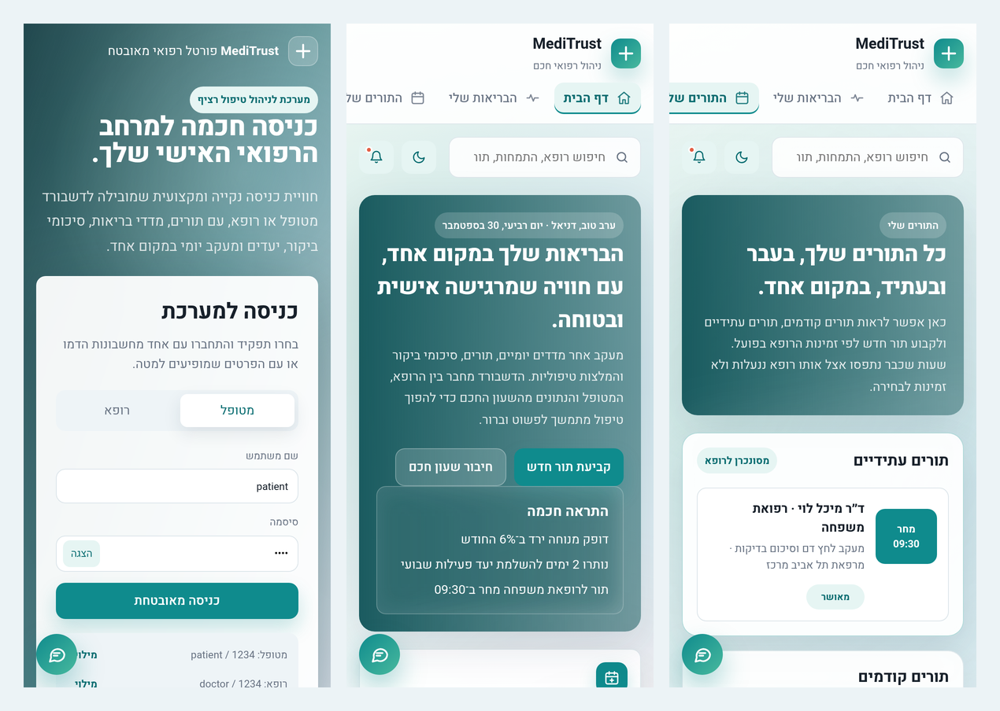

<div align="center">


# DocDash · MediTrust

**A patient–doctor healthcare portal: real-time booking, wearable health metrics and a doctor dashboard in one place.**

[](https://aa918.github.io/DocDash/)




</div>

<div dir="rtl">

## על הפרויקט

**MediTrust** הוא פורטל רפואי חכם שמחבר בין מטופלים לרופאים בממשק אחד נקי ומהיר.
המטופל קובע תור לפי זמינות אמיתית של הרופא, עוקב אחרי מדדי בריאות מהשעון החכם ומקבל המלצת אימון לפי ההיסטוריה שלו,
והרופא רואה את הלו״ז שלו מתעדכן בזמן אמת עם כל תור חדש.

הפרויקט נבנה ב-HTML, CSS ו-JavaScript נקיים, בלי ספריות ובלי שלב build. הוא מותאם לעברית (RTL), למובייל ולמצב כהה.

### 🚀 [לצפייה בדמו החי ←](https://aa918.github.io/DocDash/)

| תפקיד | שם משתמש | סיסמה |
| :-- | :-- | :-- |
| מטופל | `patient` | `1234` |
| רופאת משפחה – ד״ר מיכל לוי | `levi` (או `doctor`) | `1234` |
| קרדיולוג – ד״ר אמיר כהן | `cohen` | `1234` |
| רופאת ילדים – ד״ר נועה פרידמן | `friedman` | `1234` |

## ✨ יכולות עיקריות

**למטופל**
- 📅 **קביעת תורים בזמן אמת.** בוחרים רופא, התמחות, תאריך ושעה. שעה שנבחרה ננעלת, ושעות תפוסות חסומות כדי למנוע כפילויות.
- ❤️ **מעגל בריאות.** ציון בריאות, דופק, שינה, צעדים ולחץ דם, כולל סימולציה של סנכרון Apple Watch.
- 🏃 **מחשבון מוכנות לאימון.** מזינים מדדים יומיים והאלגוריתם משווה להיסטוריה האישית, מחשב רמת עייפות וממליץ על אימון (עם דמות מונפשת שמשתנה לפי המצב).
- 🎯 **יעדים, הישגים ותזכורות טיפול.** מעקב רציף וצ׳ק־אין יומי של מצב הרוח.
- 💬 **עוזר רפואי חכם.** צ׳אט שמכוון לשירות המתאים ומזהה מקרים דחופים.
- 🔎 **חיפוש גלובלי.** לפי רופא, התמחות או מדד, עם קיצור מקלדת `/`.

**לרופא**
- 🩺 **לו״ז אישי** שמסונן לפי הרופא המחובר ומתעדכן מיד כשמטופל קובע תור.
- 🚦 **סימון דחיפות** (גבוה / בינוני / נמוך) ותצוגת פרטי מטופל ומדדים לפני הביקור.
- 📝 **סיכום ביקור** ושליחה למטופל.

**חוויית משתמש**
- 🌗 מצב כהה שנשמר ומכבד את הגדרות המערכת
- 📱 רספונסיבי מלא: ניווט אופקי ומותאם למסכי טלפון
- ♿ נגישות: ניווט מקלדת, `aria` מלא, קישור "דילוג לתוכן" ותמיכה ב-`prefers-reduced-motion`
- 🔒 כל הקלט של המשתמש עובר escaping לפני הצגה (הגנה מ-XSS)

</div>

## 📸 Screenshots

| Patient dashboard | Health & readiness |
| :-: | :-: |
|  |  |
| **Real-time booking** | **Doctor dashboard** |
|  |  |
| **Dark mode + assistant** | **Mobile** |
|  |  |

## 🛠 Tech & architecture

- **Vanilla stack**: semantic HTML5, modern CSS (custom properties, grid, `backdrop-filter`, `conic-gradient`) and ES2020 JavaScript. No framework and no build step.
- **Theming**: every color is a CSS variable, and dark mode overrides the token set rather than individual components.
- **State**: booked appointments and metric history are saved to `localStorage`, so a booking made as a patient appears right away in the matching doctor's dashboard.
- **Readiness algorithm**: compares today's sleep, resting heart rate, steps and calories with the user's rolling averages, applies penalties for red flags, and returns a 0–100 score plus a workout recommendation.

```
DocDash/
├── index.html              # App markup (login, patient & doctor views)
├── assets/
│   ├── css/styles.css      # Design tokens, components, dark mode, responsive
│   ├── js/app.js           # Auth, routing, booking engine, readiness, chat, search
│   └── img/favicon.svg
└── docs/screenshots/       # README images
```

## ▶️ Run locally

```bash
git clone https://github.com/aa918/DocDash.git
cd DocDash
# open index.html directly, or serve it:
npx serve .        # or: python3 -m http.server
```

## 🗺 Roadmap

- [ ] Backend and real authentication (Node/Express + JWT, or Firebase)
- [ ] Real email / SMS appointment confirmations
- [ ] Full English locale (i18n)
- [ ] Apple Health / Google Fit integration

> **Note:** This is a front-end demo. All patients, doctors and medical data are fictional, and nothing leaves the browser.

## 📄 License

[MIT](LICENSE) © 2026 aa918
